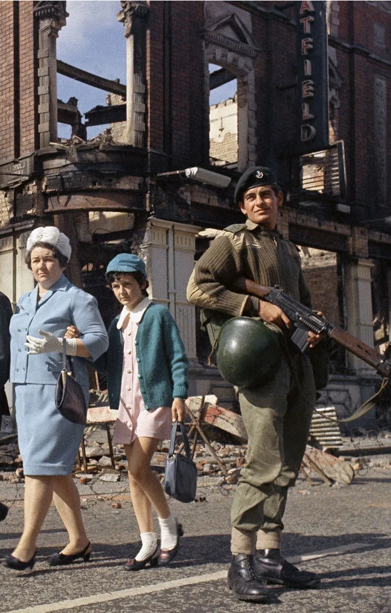
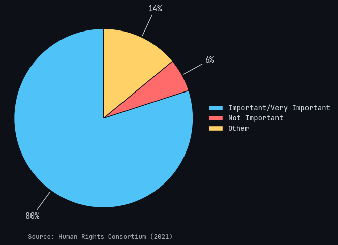
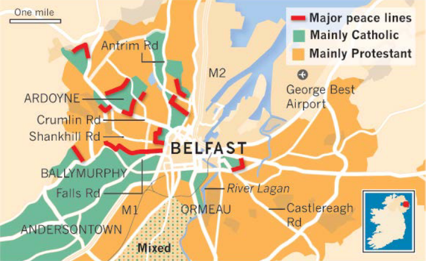
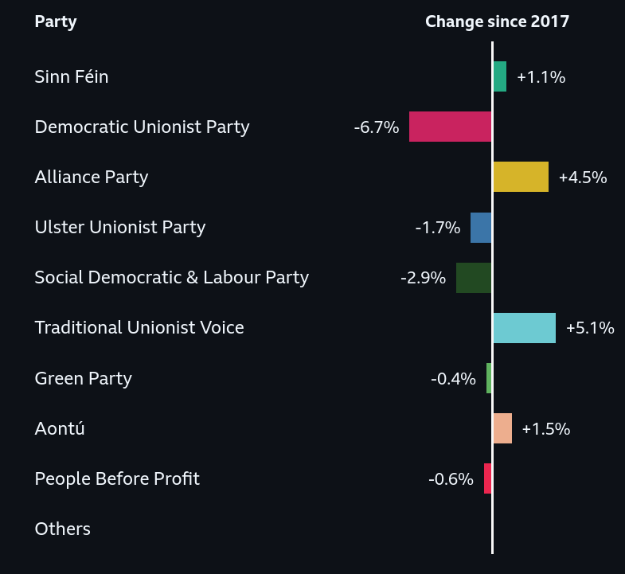

# The Good Friday Agreement
*\- sustainable peace or temporary solution?*

---

# Table of Contents
1. Introduction
   1.1 Defining the leading question
   1.2 Particular focus and why
2. Background of the Troubles
   2.1 Government of Ireland Act & Discrimination of Catholics
   2.2 Civil Rights Movement
   2.3 Emergence of the Provisional IRA & Loyalist Paramilitaries
   2.4 Internment, Peace Walls & Bloody Sunday
   2.5 First Peace Talks

---

# Table of Contents (2)

3. The Good Friday Agreement
   3.1 The Three Strands
   3.2 Principle of Consent
   3.3 Security and Justice Reforms
   3.4 Legal Dimension
   3.5 Political and Institutional Dimension
   3.6 Economical Dimension
   3.7 Social/Cultural Dimension
4. Evaluation
   4.1 Overview
   4.2 Weaknesses: Divided Society
   4.3 Weaknesses: Political Stalling
   4.4 Strengths: End of the Violence
   4.5 Strengths: Stable Political System
   4.6 Final Verdict
   4.7 Possible Improvements

---

# Introduction

**Defining the leading question:**
- Strengths and weaknesses of the agreement
- Could it have addressed the actual causes more instead of just forcing
peace?

**Particular focus and why?**
- Good Friday Agreement
- Developments leading up to it

---

# Background of the Troubles

**Government of Ireland Act**
- "Old English" displacing Irish in Ulster
- Division of the Isle of Ireland in Northern Ireland and Republic of
Ireland

**Systematic Discrimination of Catholics:**
- protestants outnumbered Catholics &rarr; biased voting
- limited representation of Catholics

**Key actors:**
- British- and Irish government
- UUP
- civilians

---

# Background of the Troubles

**Civil rights movement**
- NICRA organizes marches to protest against discrimination and
“gerrymandering” &rarr; violent suppression of marchers by RUC
- Battle of Bogside
- arrival of British army

**Key actors**:
- NICRA
- RUC
- British army

---

# Background of the Troubles
**Emergence of the Provisional IRA (Provos) and loyalist paramilitaries**
- British army ultimately viewed as enemy 
&rarr; Provisional IRA as defenders of the nationalist cause
- Armed Unionist organizations: UVF, UDA

**Key actors:** 
- Irish Republican Army
- Unionist Paramilitaries

---

# Background of the Troubles
**Internment, "peace walls“, and „Bloody Sunday“**
- "One man, one vote"
- Building of Peace Walls
- Bloody Sunday: British troops fired on catholic civil rights activists 
&rarr; highest level of recruitment in Provisional IRA

**Key actors:** 
- Northern Ireland government

---

# Background of the Troubles
**First peace talks**
- began 1973 with Sunningdale Agreement 
- continued with the 1985 Anglo-Irish-Agreement
➔ Both failed

**Key actors:**
- Northern Irish parties
- British government
- Irish government

---

# The Good Friday Agreement
- Peace Treaty signed by British and Irish governments on April 10, 1998

---

# The Good Friday Agreement

**The Three Strands**
- Strand 1: Northern Ireland Assembly
- Strand 2: North/South Ministerial Council
- Strand 3: 
  - British-Irish Council
  - British-Irish Intergovernmental Conference

---

# The Good Friday Agreement

## Northern Ireland Assembly
- 108 Elected Members 
&rarr; self-designated Nationalist or Unionist
> A 108-member Assembly will be elected by PR(STV) from existing
Westminster constituencies.

- major decisions require cooperation between Nationalist and Unionist
> ...key decisions are taken on a cross-community basis
---

# The Good Friday Agreement

**The Three Strands**
- Strand 1: Northern Ireland Assembly
- Strand 2: North/South Ministerial Council
- Strand 3: 
  - British-Irish Council
  - British-Irish Intergovernmental Conference

---

# The Good Friday Agreement

## North/South Ministerial Council

- Ministers from Northern Ireland Executive and Irish Government
  → cooperation and decision-making on cross-border issues
- 6 formal areas of cooperation
- Plenary meetings twice a year
- *mutually interdependent with the Northern Ireland Assembly*
> The North/South Ministerial Council and the Northern Ireland
Assembly are mutually inter-dependent, and that one cannot
successfully function without the other.

---

# The Good Friday Agreement

**The Three Strands**
- Strand 1: Northern Ireland Assembly
- Strand 2: North/South Ministerial Council
- Strand 3: 
  - British-Irish Council
  - British-Irish Intergovernmental Conference

---

# The Good Friday Agreement

## British-Irish Council
- membership: British & Irish Governments, devolved institutions
  in NI, Scotland, Wales, Isle of Man and Channel Islands
- meets at summit level twice per year

> A British-Irish Council (BIC) will be established [...] to promote
the harmonious and mutually beneficial development of the totality
of relationships among the peoples of these islands.

---

# The Good Friday Agreement

## The Three Strands
- Strand 1: Northern Ireland Assembly
- Strand 2: North/South Ministerial Council
- Strand 3: 
  - British-Irish Council
  - British-Irish Intergovernmental Conference

---

# The Good Friday Agreement

## British-Irish Intergovernmental Conference
- replaces institutions established under the 1985 Anglo-Irish Agreement
- co-chaired by Irish Minister for Foreign Affairs &
  UK Secretary of State for Northern Ireland
- Irish Government can put forward views on non-devolved NI matters

> It will establish a standing British-Irish Intergovernmental
Conference, which will subsume both the Anglo-Irish Intergovernmental Council and
the Intergovernmental Conference established under the 1985 Agreement.

---

# The Good Friday Agreement

**Principle of Consent**
- Legally recognized Northern Ireland as part of the UK
- "Border Poll" - United Ireland only possible with majority in North and South
- Republic of Ireland removed territorial claim to the North from constitution

> It is hereby declared that Northern Ireland in its entirety remains
part of the United Kingdom and shall not cease to be so without the
consent of a majority of the people of Northern Ireland.

---

# The Good Friday Agreement

**Security and Justice Reforms**
- decommissioning of paramilitary groups
> All participants accordingly reaffirm their commitment to the total
disarmament of all paramilitary organisations.
- police reforms
- prisoner release
> Both Governments will put in place mechanisms to provide for an
accelerated programme for the release of prisoners.

---

# The Good Friday Agreement

## Legal Dimension

- new framework around human rights
- decommissioning
- constitutional guarantees
- links to ECHR (European Convention on Human Rights)

*promises have only partly been implemented*

---

# The Good Friday Agreement

## Political and Institutional Dimension

- classic model of power sharing
- negotiated conflict management

*institutions only work if all stakeholders cooperate* 

---

# The Good Friday Agreement

## Economical Dimension

- broad agenda for economic resurrection
- peace dividend
- 'disappointingly small' impact for some communities

---

# The Good Friday Agreement

## Social/Cultural Dimension

- building mutual respect
- police reform
- civic forum
> A consultative Civic Forum will be established.[...] 
It will act as a consultative mechanism on social, economic and
cultural issues

&rarr; *too little done to address the issues*

---

# Evaluation

| Weaknesses (&rarr; temporary solution) | Strengths (&rarr; sustainable peace) |
| ---         | ---         |
| Divided Society | End of the Violence|
| Political Stalling | Stable Political System |
---

# Evaluation - Weaknesses

## Divided Society

- Ongoing Division
  - Schools separated religiously
  - Segregation in electoral behaviour
  - Residential segregation

*Evaluation Criteria: **Tolerance***

---

# Evaluation - Weaknesses

## Political Stalling

- Institutions vulnerable to political deadlocks 
  - Vetoes delay decisions 

*Evaluation Criteria: **Ability to Act***

---

# Evaluation - Strengths

## End of the Violence
- Agreement improved day-to-day life for citizens
> [...] my teenage years were immeasurably safer and more normal than those of my parents, largely because of the Agreement and the work which led up to it
- Most paramilitary organizations stopped fighting

---

# Evaluation - Strengths 

## Stable Political System
- Provided a slow, but working system for the past 28 years
- Danger of a broken system prevent system from breaking

---

# Evaluation

## Final Verdict
- No definitive answer possible
- Cross community parties on uprise
- ⁠Tends to get sustainable at the moment 

---

# Evaluation

## Possible Improvements
- Legally binding deadlines for Bill of Rights and a permanent Civic Forum
- Removal of peace walls
&rarr; addresses residential segregation
- Development of new social reconciliation strategies
&rarr; preferably also legally binding

---

# Thank you for your attention!
## Sources &rarr;

---

# References (1–4)

**Coakley, John** (2002)  
*Religion, National Identity and Political Change in Modern Ireland*  
Irish Political Studies, 17(1), pp. 4–28  
https://doi.org/10.1080/714003140  

**Cradden, Terry & Teague, Paul** (1992)  
*Labour Market Discrimination and Fair Employment in Northern Ireland*  
International Journal of Manpower, 13(6), pp. 3–15  
https://doi.org/10.1108/eum0000000000906  

**Melaugh, Martin** (2005)  
*IRA Statement on the Ending of the Armed Campaign*  
Ulster University  
https://cain.ulster.ac.uk/othelem/organ/ira/ira280705.htm  

**Hall, Amanda** (2018)  
*Incomplete Peace and Social Stagnation*  
Open Library of Humanities, 4(2)  
https://doi.org/10.16995/olh.251  

---

# References (5–8)

**Government of Ireland** (1998)  
*Good Friday Agreement*  
Government of Ireland
https://assets.ireland.ie/documents/good-friday-agreement.pdf  

**Walker, Alex** (2023)  
*Unionism and the Belfast/Good Friday Agreement*
UK in a Changing Europe
https://ukandeu.ac.uk/unionism-and-the-belfast-good-friday-agreement/

**Haire, Siobhan** (2020)  
*Building a Lasting Peace: 25 Years of the Good Friday Agreement*  
Quaker
https://www.quaker.org.uk/blog/25-years-since-the-good-friday-agreement-reflections-from-a-quaker  

**Human Rights Consortium** (2023)  
*Government Betrays Good Friday Agreement on Bill of Rights*
Human Rights Consortium
https://www.humanrightsconsortium.org/government-betrays-good-friday-agreement-on-bill-of-rights/  

---

# References (9-12)

**Wallenfeldt, Jeff** (2019)  
*The Troubles*  
Encyclopedia Britannica  
https://www.britannica.com/event/The-Troubles-Northern-Ireland-history  

**Renwick, Alan & Kelly, Conor** (2023)  
*Perspectives on the Belfast/Good Friday Agreement*  
University College London
https://www.ucl.ac.uk/social-historical-sciences/sites/social_historical_sciences/files/205_-_perspectives_on_the_belfast_good_friday_agreement.pdf

**Dr. Roulston, Stephen** (2023)
*The cost of division in Northern Ireland*
Ulster University
https://www.ief.org.uk/wp-content/uploads/2023/04/TEUU-Report-18-Divided-Society-Divided-Education.pdf 

**Murtagh, Cera** (2019)  
*Northern Ireland: Power-Sharing in Crisis* 
50 Shades of Federalism  
http://50shadesoffederalism.com/case-studies/northern-ireland-power-sharing-in-crisis/

---

# References (13-14)

**Coulter, Colin** (2019)
*Northern Ireland's elusive peace dividend: Neoliberalism, austerity and the politics of class*
Capital & Class, 43(1), pp. 123–138
https://doi.org/10.1177/0309816818818309

**Human Rights Consortium** (2021)
*Survey finds 80% support Bill of Rights for Northern Ireland*
Human Rights Consortium
https://www.humanrightsconsortium.org/assembly-committee-survey-finds-80-support-bill-rights-northern-ireland/

---

# Media Sources (1-3)

Unknown Cartographer (n.d.)
Map of the Four Provinces of Ireland
Dickinson College Commentaries
https://dcc.dickinson.edu/sites/default/files/Map%20of%20provinces.gif

**Peter Kemp** (1969)
*Everyday life during the Troubles*
Britannica
https://www.britannica.com/event/The-Troubles-Northern-Ireland-history#/media/1/1300883/240001

**William L. Rukeyser** (1972)
*Mass arrests on Bloody Sunday*
Britannica
https://www.britannica.com/event/The-Troubles-Northern-Ireland-history#/media/1/1300883/326292

---

# Media Sources (4-6)

**Whyte's** (1998)
*The front cover of the Good Friday Agreement, signed by the participants*
BBC News
https://ichef.bbci.co.uk/ace/standard/976/cpsprodpb/112B1/production/_100712307_hi017054094.jpg.webp

**Unknown Author** (2011)
*Map of Belfast showing peace walls, along with Catholic and Protestant neighbourhoods*
York University
https://gjis.journals.yorku.ca/index.php/gjis/article/download/40244/36419/50211

**McQuillan, Charles** (2023)
*Good Friday Agreement Anniversary*
UK in a Changing Europe
https://media.ukandeu.ac.uk/wp-content/uploads/2023/04/Charles-McQuillan-Stringer-Good-Friday-Agreement-anniversary-edited-2000x1235.jpg
